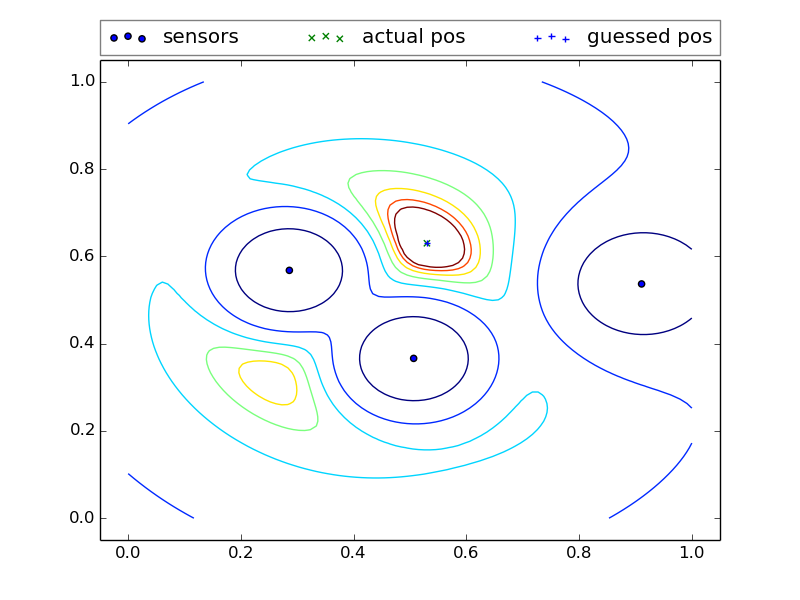
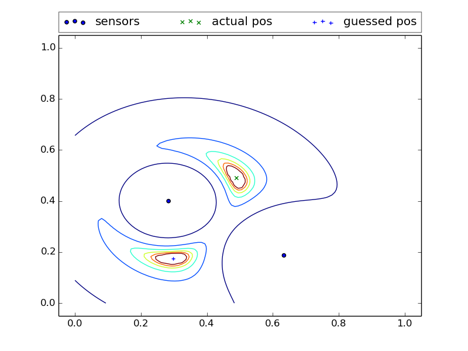
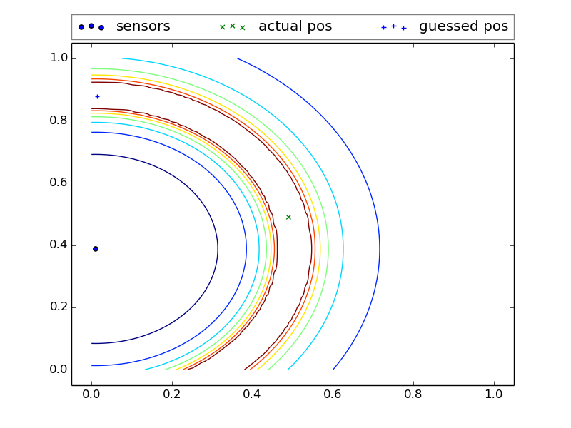

sound-location
==============

Given a non-uniform 2D array of sensors and a function that correlates signal to distance, this function will find the location potential field of a source.

Sound can of course be triangulated:

Narrowed to limited set of locations:

Or limited to a ring of a known distance, but only if the original sound source volume is known:

The sound attenuation model is a simple inverse function that is assumed for sound pressure.  Sound intensity is another option if we have multiple microphones per Guardian.  Another big improvement may include looking at multiple frequency attenuation.  I think it is highly likely that high-frequencies will attenuate predictably faster than low ones in a canopy.  The distance function can be derived the sound's high-freq/low-freq ratios.  This would need to be calibrated emperically from sound data collected at various distances.  But only need to be done once for a representative type of canopy.

Another set of low-cost calibration data could be to have one guardian "chirp" to another at various frequencies and fine-tue the attenuation models for a specific location.  This assumes they are close enough to each other and they are loud enough to do so...